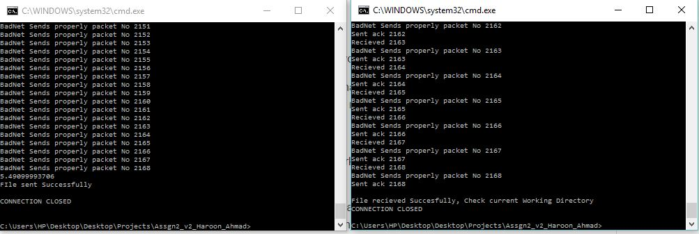

# ComputerNetworks
Reliable Data Transfer Over Unreliable Data Transferring Protocol

The project contains 3 files 
MyClient.py
MyServer.py
Report.pdf

Description of files:

MyClient.py:
How to run : Python MyClient.py [Server Port] [Filename which you want to transfer to the server]

The Client sends the file to the server. MyClient uses 5 badnet files each file has a different way of making the protocol unreliable.Measures are taken for covering all the badnet files whose detail is mentioned in the file Report.pdf

MyServer.py:
How to run : Python MyServer.py [Server Port]

The Server Recieve the file from the client and save this file in the current working directory.Server also cover all the badnet files for reliable transfer of data

Report.pdf:
Report file contains the information about how all the badnet file cases were countered and which techniques and functions are used for this purposes.The file also contains the description of the badnet files (ie what disturbance it is creating and how it is solved)

